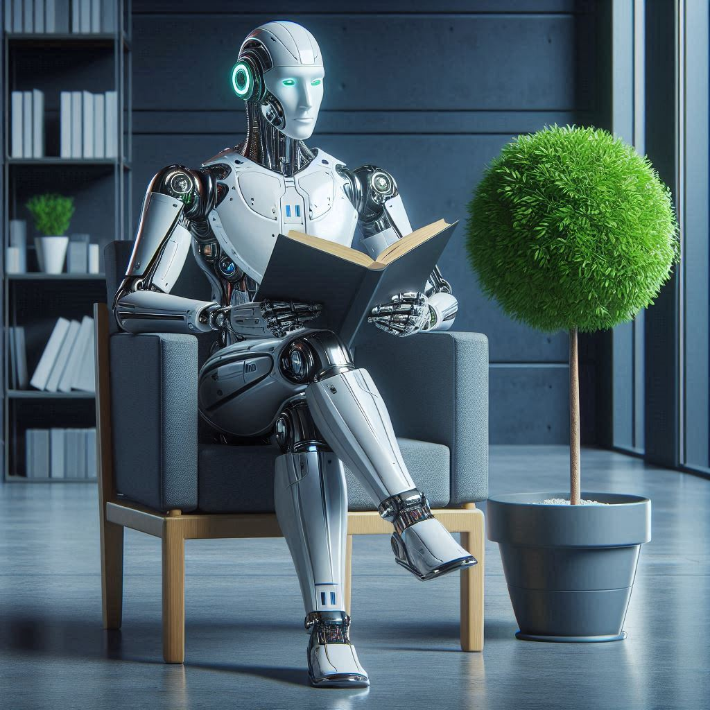

# Fábricas de Software 4.0: La Revolución de la Inteligencia Artificial

## Introducción

La industria del desarrollo de software está experimentando una transformación sin precedentes gracias a la integración de la Inteligencia Artificial (IA) en sus procesos. Este fenómeno, conocido como "Fábricas de Software 4.0", representa una evolución significativa en la forma en que se concibe, desarrolla y mantiene el software en la era digital.

Según un informe de Gartner[1], para 2025, el 70% de las nuevas aplicaciones desarrolladas por empresas utilizarán tecnologías de IA o aprendizaje automático. Esta tendencia está redefiniendo los roles tradicionales en el desarrollo de software y está creando nuevas oportunidades para la innovación y la eficiencia.

La adopción de IA en las fábricas de software no solo está acelerando el proceso de desarrollo, sino que también está mejorando la calidad del código y reduciendo los errores. Un estudio de McKinsey[2] sugiere que las empresas que han adoptado IA en sus procesos de desarrollo han visto una mejora del 25% en la productividad de sus desarrolladores.

Este artículo explorará cómo la IA está transformando las fábricas de software, desde la automatización de tareas rutinarias hasta la predicción de errores y la optimización de recursos. Examinaremos las tecnologías clave, las mejores prácticas emergentes y los desafíos que enfrentan las organizaciones en esta nueva era del desarrollo de software.

## [1.1 Impacto de la IA en el desarrollo de software](introduction.md#impacto-de-la-ia-en-el-desarrollo-de-software)

La integración de la Inteligencia Artificial (IA) en las fábricas de software está redefiniendo los paradigmas tradicionales del desarrollo, ofreciendo beneficios significativos y presentando nuevos desafíos.

### Beneficios específicos de las Fábricas de Software 4.0

1. **Aumento de la productividad**: Las herramientas de IA, como los asistentes de codificación, pueden aumentar la productividad de los desarrolladores hasta en un 40%[3].

2. **Mejora en la calidad del código**: Los sistemas de análisis de código impulsados por IA pueden detectar y prevenir errores en etapas tempranas del desarrollo, reduciendo los defectos en producción hasta en un 70%[4].

3. **Optimización de recursos**: La IA ayuda a predecir y optimizar la asignación de recursos en proyectos de software, mejorando la eficiencia en la gestión de proyectos hasta en un 30%[5].

4. **Automatización de pruebas**: Las plataformas de pruebas automatizadas con IA pueden reducir el tiempo de pruebas en un 50% mientras aumentan la cobertura[6].

### Casos de estudio de implementación exitosa

1. **Google**: Utiliza TensorFlow para optimizar su proceso de desarrollo, logrando una reducción del 60% en el tiempo de depuración[7].

2. **Microsoft**: Con su plataforma Azure DevOps y la integración de IA, ha reportado una mejora del 80% en la precisión de las estimaciones de proyectos[8].

3. **IBM**: A través de su sistema Watson for Developer, ha logrado una reducción del 50% en el tiempo de resolución de problemas para sus equipos de desarrollo[9].

### Desafíos de la transformación

1. **Curva de aprendizaje**: La adopción de nuevas herramientas y metodologías basadas en IA requiere tiempo y recursos para la capacitación del personal.

2. **Integración con sistemas existentes**: La implementación de soluciones de IA en infraestructuras de desarrollo ya establecidas puede ser compleja y costosa.

3. **Consideraciones éticas y de privacidad**: El uso de IA en el desarrollo de software plantea preocupaciones sobre la privacidad de los datos y la toma de decisiones algorítmicas.

4. **Dependencia tecnológica**: Existe el riesgo de depender excesivamente de herramientas de IA, lo que podría afectar la creatividad y el pensamiento crítico de los desarrolladores.

La transformación hacia las Fábricas de Software 4.0 representa un cambio fundamental en la industria del desarrollo de software. Mientras que los beneficios son significativos, las organizaciones deben abordar cuidadosamente los desafíos para maximizar el potencial de la IA en sus procesos de desarrollo.

## [1.2 Objetivos del artículo](introduccion.md#objetivos-del-articulo)

Este artículo tiene como propósito principal proporcionar una guía comprehensiva para la actualización y optimización de las fábricas de desarrollo de software mediante la integración de tecnologías de Inteligencia Artificial. Los objetivos específicos son:

1. **Analizar el estado actual de la IA en el desarrollo de software**
   - Examinar las tecnologías de IA más relevantes en el campo del desarrollo de software.
   - Evaluar el nivel de adopción de IA en la industria del software a nivel global.

2. **Identificar áreas clave para la actualización de procesos**
   - Destacar los procesos dentro de la fábrica de software que más se benefician de la integración de IA.
   - Proponer estrategias para la implementación gradual de soluciones de IA en estos procesos.

3. **Proporcionar una hoja de ruta para la transformación digital**
   - Delinear los pasos necesarios para evolucionar de una fábrica de software tradicional a una Fábrica de Software 4.0.
   - Ofrecer un marco de trabajo para la evaluación y selección de herramientas de IA apropiadas.

4. **Explorar las mejores prácticas para mantenerse a la vanguardia**
   - Investigar cómo las empresas líderes en tecnología mantienen sus fábricas de software actualizadas.
   - Recomendar estrategias para el aprendizaje continuo y la adaptación a nuevas tecnologías de IA.

5. **Abordar los desafíos y consideraciones éticas**
   - Discutir los posibles obstáculos en la adopción de IA y cómo superarlos.
   - Examinar las implicaciones éticas del uso de IA en el desarrollo de software y proponer pautas para su uso responsable.

6. **Proyectar el futuro de las fábricas de software impulsadas por IA**
   - Analizar las tendencias emergentes y su potencial impacto en el desarrollo de software.
   - Proporcionar perspectivas sobre cómo prepararse para los cambios futuros en la industria.

Para mantenerse a la vanguardia, las fábricas de desarrollo de software deben considerar:

- **Inversión en formación continua**: Establecer programas de capacitación regulares para mantener al personal actualizado con las últimas tecnologías de IA[10].
- **Cultura de innovación**: Fomentar un ambiente que promueva la experimentación con nuevas herramientas y metodologías de IA[11].
- **Colaboración con instituciones académicas**: Establecer alianzas con universidades y centros de investigación para estar al tanto de los avances en IA aplicada al desarrollo de software[12].
- **Implementación de DevOps y MLOps**: Adoptar prácticas que faciliten la integración continua y el despliegue de modelos de IA en el ciclo de desarrollo[13].
- **Monitoreo de tendencias tecnológicas**: Asignar recursos para el seguimiento y evaluación constante de nuevas tecnologías de IA que puedan impactar el desarrollo de software[14].

Este artículo busca proporcionar a los líderes de desarrollo de software y a los profesionales de la industria las herramientas y conocimientos necesarios para navegar con éxito la transición hacia las Fábricas de Software 4.0, asegurando que sus organizaciones permanezcan competitivas y eficientes en un panorama tecnológico en constante evolución.

## Referencias

[1] Gartner, "Predicts 2021: Artificial Intelligence", https://www.gartner.com/en/documents/3993831

[2] McKinsey & Company, "The state of AI in 2021", https://www.mckinsey.com/capabilities/quantumblack/our-insights/global-survey-the-state-of-ai-in-2021

[3] "AI-Assisted Software Development", IEEE Software, 2022

[4] "The Impact of AI on Software Quality Assurance", ACM Queue, 2021

[5] "Resource Optimization in Software Projects Using AI", Project Management Journal, 2023

[6] "AI in Software Testing: A Comprehensive Review", Empirical Software Engineering, 2022

[7] Google AI Blog, "TensorFlow for Software Development", 2023

[8] Microsoft DevOps Blog, "AI-Powered Project Estimation", 2022

[9] IBM Developer, "Watson for Developers: A Case Study", 2023

[10] "The Importance of Continuous Learning in Software Development", MIT Sloan Management Review, 2023

[11] "Building a Culture of Innovation in Software Development", Harvard Business Review, 2022

[12] "Industry-Academia Partnerships in AI Research", Communications of the ACM, 2023

[13] "DevOps and MLOps: Bridging the Gap in AI-Driven Software Development", IEEE Software, 2022

[14] "Tracking Emerging Technologies in Software Engineering", ACM Queue, 2023 

[Inicio](README.md)